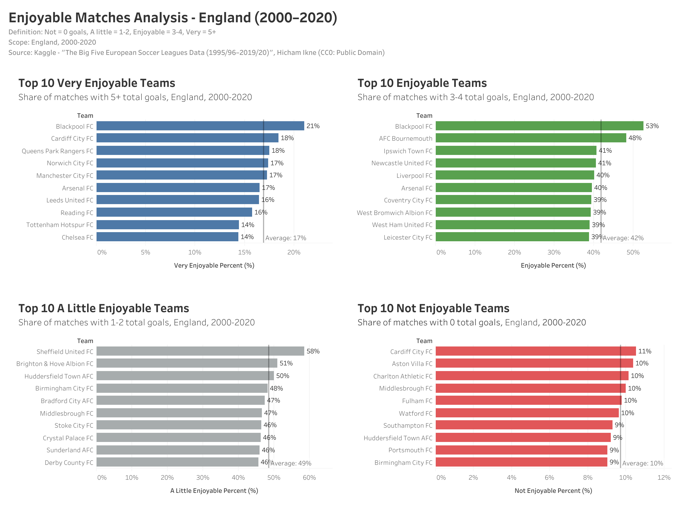

# Enjoyable Matches Analysis - England (2000–2020)

This project analyzes football matches in the English Premier League between 2000 and 2020, based on goal counts, to determine which teams had the most "enjoyable" matches.

The analysis is built on the [Big Five European Soccer Leagues dataset](https://www.kaggle.com/datasets/hikne/the-big-five-european-soccer-leagues-data) (CC0 Public Domain).

---

## Objective
Classify matches by the total number of goals and calculate the share of each category for every team:

- **Not Enjoyable:** 0 goals  
- **A Little Enjoyable:** 1–2 goals  
- **Enjoyable:** 3–4 goals  
- **Very Enjoyable:** 5+ goals  

---

## Method

1. **Data Source**  
   - `data/raw/big_five_1995_2019.csv` (raw Kaggle dataset, 44k+ matches across England, Germany, Spain, Italy, France)  

2. **SQL Processing**  
   - Queries in `sql/england_2000_2020_enjoyable_summary.sql`  
   - Filters: `Country = 'ENG'` and `Year >= 2000`  
   - Classification with CASE statements → output stored in `data/processed/enjoyable_matches.csv`

3. **Visualization**  
   - Tableau Public used to build dashboards  
   - Exported as `visuals/enjoyable_matches_analysis.png`  

---

## Results
- **Top 10 Very Enjoyable Teams**: clubs with the highest share of 5+ goal matches  
- **Top 10 Enjoyable Teams**: clubs with the highest share of 3–4 goal matches  
- **Top 10 A Little Enjoyable Teams**: clubs with the highest share of 1–2 goal matches  
- **Top 10 Not Enjoyable Teams**: clubs with the highest share of 0–0 matches  

Visualization:  


---

## Repository Structure
```
enjoyable-matches/
│
├── data/
│   ├── raw/
│   │   └── big_five_1995_2019.csv
│   └── processed/
│       └── enjoyable_matches.csv
│
├── sql/
│   └── england_2000_2020_enjoyable_summary.sql
│
├── visuals/
│   └── enjoyable_matches_analysis.png
│
└── README.md
```

---

## Source
- Dataset: *The Big Five European Soccer Leagues Data (1995–2019/20)* — Hicham Ikne (Kaggle, CC0 Public Domain)
